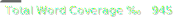
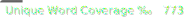
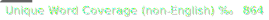

# Cornish Spellchecker

This is a spellchecker for the Cornish language. It uses wordlists in the Standard Written Form that cover both Middle and Late Cornish combined. The spellchecker is based on Hunspell and but is also packaged for other applications that use the Hunspell framework, such as LibreOffice and Firefox.

## Scores

Current scores:

Total word coverage weights words by their frequency in examples. Unique words coverage is just what score by unique spelling. Scores are out of 1000. The non-English percentage uses the Ubuntu Hunspell dictionary to exclude words that appear in English, since the sample includes people and company names that are common in English. 

# Install

The latest releases can be found in the [Releases](https://github.com/cornish-tools/cornish-spellchecker/releases) section.

## LibreOffice

- Ensure LibreOffice is installed.
- Find the [latest release](https://github.com/cornish-tools/cornish-spellchecker/releases).
- Download the LibreOffice OXT file.
- Double-click on that and the dictionary will be installed into LibreOffice.

## Firefox

- Ensure Firefox is installed.
- Find the [latest release](https://github.com/cornish-tools/cornish-spellchecker/releases).
- Download the Mozilla XPI file.
- Double-click on that and the dictionary will be installed into Firefox or drag the XPI file into Firefox.

## Thunderbird

Thunderbird is an email client. Instructions can be found on [their website](https://support.mozilla.org/en-US/kb/installing-addon-thunderbird#w_a-slightly-less-ideal-case-install-from-a-downloaded-xpi-file).

- Ensure Thunderbird is installed.
- Find the [latest release](https://github.com/cornish-tools/cornish-spellchecker/releases).
- Download the Mozilla XPI file.
- Drag the XPI file into Thunderbird and the dictionary will be installed.

# Run

## Hunspell

A helpful tool is to use the `-m` flag to run morphological analysis:
* po - part of speech
* ds - cause of the affix

# Feedback

This is a maintained project. It will benefit from feedback on issues identified with the dictionary. As such, please [raise issues here](https://github.com/cornish-tools/cornish-spellchecker/issues).

# License

Copyright (c) 2023 Cornish Tools, Cornish Language Office and Akademi Kernewek

The data herein is derived from that provided by the Cornish Language Office and Akademi Kernewek, released under [Creative Commons Attribution NonCommercial](https://creativecommons.org/licenses/by-nc/4.0/). As such, these spellcheckers are released under the same licence and without warranty:

The software is provided "as is", without warranty of any kind, express or implied, including but not limited to the warranties of merchantability, fitness for a particular purpose and noninfringement. In no event shall the authors or copyright holders be liable for any claim, damages or other liability, whether in an action of contract, tort or otherwise, arising from, out of or in connection with the software or the use or other dealings in the software.
