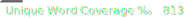

# Cornish Spell-Checker

> [!NOTE]
> For Non-Commercial Use. See license below.

This is a spell-checker for the Cornish language. It uses word lists in the Standard Written Form that cover both Middle and Late Cornish combined. The spell-checker is based on Hunspell and but is also packaged for other applications that use the Hunspell framework: LibreOffice, Firefox and Thunderbird (email client).

The main part of the spell-checker is derived from the Akademi Kernewek word list provided by the Cornish Language Office. 

Thanks to the Cornish Language Office and Akademi Kernewek for their support in creating this spell-checker, particularly  to Sam Rogerson for his help and advice thoughout this project. Cornish Tools is not affiliated with either Cornish Language Office or Akademi Kernewek.

## Limitations

This spell-checker checks each word independently and does not check grammar. For example, the spell-checker can check whether a word is a valid mutation. For example, *kath* (cat) soft mutates *gath* so the spell-checker will report both words as correct. However, the spell-checker cannot tell whether the mutation is valid in the context of the sentence. For example, *an kath* and *an gath* (the cat) both have correctly spelled words so the spell-checker would report both as correct, but only *an gath* is gramatically correct.

> [!NOTE]
> The spell-checker is not complete, there is still coverage to improve (see the scores below). Some of the known gaps in coverage are listed [under issues](https://github.com/cornish-tools/cornish-spellchecker/issues). If you encounter an issue, please help us by [raising it here](https://github.com/cornish-tools/cornish-spellchecker/issues).

### Scores

Current scores:

The scores show an approximation of the coverage of the spell-checker. They are calculated from sample text in Standard Written Form. The total word coverage is the proportion of words from the text that pass the spell-checker. The unique words coverage is the proportion of words that pass the spell-checker by unique spelling. The non-English percentage uses the Ubuntu Hunspell dictionary to exclude words that appear in English, since the sample includes people and company names that are common in English. Scores are out of 1000.

# Install

The dictionary can be found on [LibreOffice Extensions](https://extensions.libreoffice.org/en/extensions/show/42004) and [Mozilla Add-Ons](https://addons.mozilla.org/en-GB/firefox/addon/ct-cornish-spell-checker-swf/). The latest releases can be found in the [Github Releases](https://github.com/cornish-tools/cornish-spellchecker/releases) section but might not notify of updates.

## LibreOffice

To install:
- Download the latest LibreOffice OXT file from  [LibreOffice Extensions](https://extensions.libreoffice.org/en/extensions/show/42004)
- Then, either:
  - Double-click on that and the spell-checker will be installed into LibreOffice.
  - In LibreOffice, go to Tools > Extension Manager.... Click Add. Choose the downloaded OXT file.

## Firefox

To install, either:
- Go to Add-ons &#129513; and search for "Cornish Spell-Checker". Click Add to Firefox. Click Add.
- Go to [Mozilla Add-Ons](https://addons.mozilla.org/en-GB/firefox/addon/ct-cornish-spell-checker-swf/). Click Add to Firefox. Click Add.
- Download the [latest Mozilla XPI file from Github](https://github.com/cornish-tools/cornish-spellchecker/releases)  and double-click on that and the spell-checker will be installed into Firefox or drag the XPI file into Firefox.

## Thunderbird

Thunderbird is an email client.

To install, either:
- Go to Settings ⚙ > Add-ons and Themes &#129513; and search for "Cornish Spell-Checker". Click Add to Thunderbird. Click Add.
- Go to [Thunderbird Add-Ons](https://addons.thunderbird.net/addon/ct-cornish-spell-checker-swf/). Click Download now. In Thunderbird, go to Settings ⚙ > Add-ons and Themes 🧩 > Go to Dictionaries 📕 > Manage Your Dictionaries ⚙ > Install Add-on From File. Select the downloaded XPI file. Click Add.
- Download the [latest Mozilla XPI file from Github](https://github.com/cornish-tools/cornish-spellchecker/releases) follow the process above to use the downloaded XPI.

In Thunderbird settings the default dictionaries for email composition can be set under Composition > Spelling.

# License

Copyright (c) 2023 Cornish Tools, Akademi Kernewek

The main part of the spell-checker is derived from the Akademi Kernewek word list provided by the Cornish Language Office, released under Creative Commons Attribution NonCommercial 4.0. This spell-checker is released under the same license <https://creativecommons.org/licenses/by-nc/4.0/>.

# Bibliography

The majority of the word list is provided by the Akademi Kernewek. Additional materials were referenced to apply the rules of the language to the word list.

* An Outline of the Standard Written Form of Cornish. (2021). Third ed. [online] Cornwall: Akademi Kernewek. Available at: https://www.akademikernewek.org.uk/panels?locale=en [Accessed 13 Jul. 2023].
* Brown, W. (2001) *[A Grammar of Modern Cornish](https://kesva.org/publications/grammar-modern-cornish)*. Third ed. Saltash, Cornwall: Kesva an Taves Kernewek.
* Hak, T. (2019) *[Cornish Verbs in the Standard Written Form](https://kesva.org/publications/cornish-verbs)*. First ed. Hayle, Cornwall: Kesva an Taves Kernewek.
* Page, J. (2010) *[Cornish Grammar for Beginners](https://kesva.org/publications/cornish-grammar-beginners-and-auxiliary-verbs)*. Revised Standard Written Form ed. Hayle, Cornwall: Kesva an Taves Kernewek.
* Kernewek Dre Lyther. (2019). SWF ed. [online] Cornwall: Kesva an Taves Kernewek. Available at: https://kesva.org/kdl [Accessed 13 Jul. 2023].

All of the materials above use the Standard Written Form of Cornish with the exception of _A Grammar of Modern Cornish_ (2001).

# Icon

